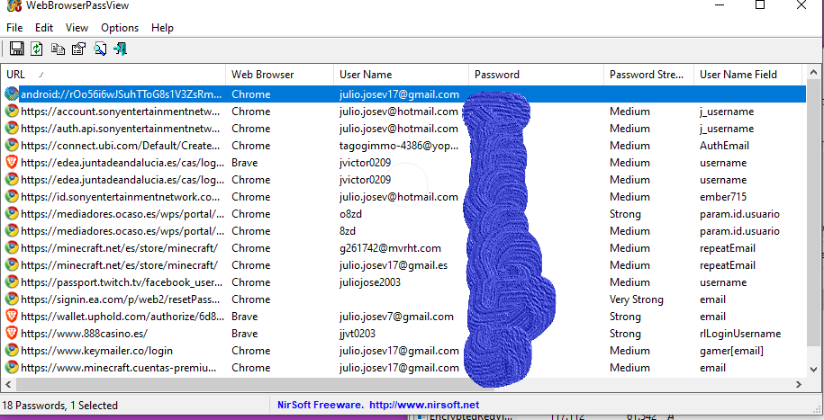

## Recuperacion de cotraseña
- En este apartado veremos como ver las contraseñas olvidadas de nuestro equipo, pero en este caso solamente de las contraseñas que hemos puesto en los navegadores de internet como google, firefox, brave, etc.
- El caso es que te muestra las contraseñas que has utilizado antiguamente o incluso las nuevas.

- En esta foto se muestra mis correos y donde esta tapado en azul son las contraseñas que he utilizado y sigo utilizando en mi equipo

- [video explicativo]()
- [link de descarga](https://www.nirsoft.net/password_recovery_tools.html)
