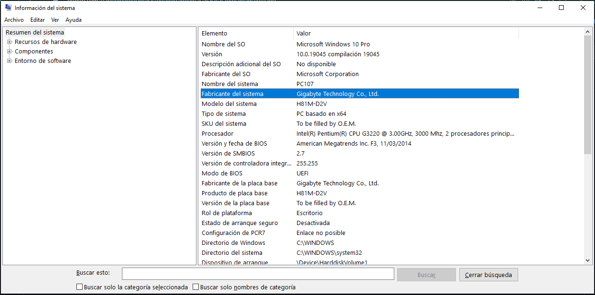

## Msinfo32
La informacion basica son los detalles esenciales (tecleando win + R, escribimos a continuacion msinfo32) que describen las caracteristicas principales de un dispositivo de computacion, como una computadora portatil o de escritorio. Esta informacion puede incluir detalles como el nombre del dispositivo, la marca y el modelo, el sistema operativo que tiene, el tipo de procesado, etc.

Esta informacion es importante porque permite a los usuarios saber que tipo de dispositivo estan utilizando y comprender mejor sus capacidades y limitaciones.

