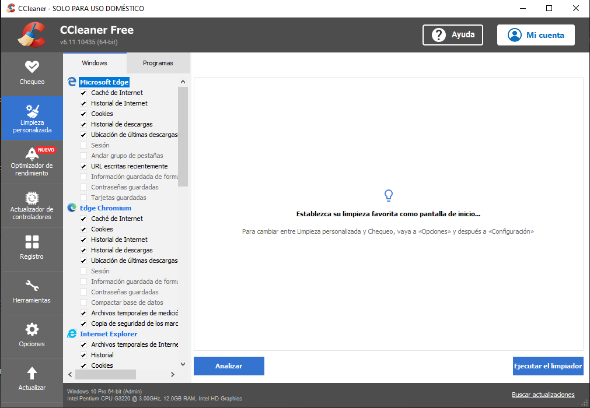
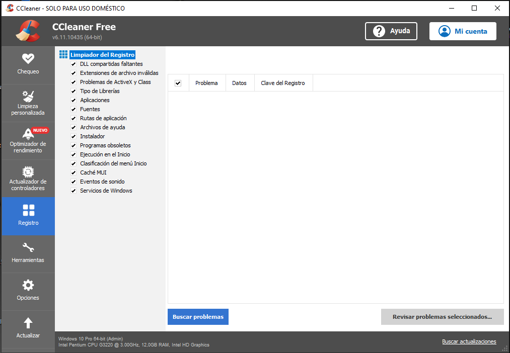

# C Cleaner

Ccleaner es una aplicación gratuita para sistemas Windows que sirve para realizar una limpieza y puesta a punto del Sistema Operativo del PC. Con Ccleaner, podemos realizar una limpieza a fondo del PC de una forma sencilla, con lo que conseguiremos ganar espacio en el disco duro y evitar que el PC se ralentice a emas de otras funciones.

* De Las opciones que nos proporciona CCleaner las mas destacadas son Limpieza personalizada y registro, ya que el resto o son solo usables con la versión de pago o no merece la pena usarlas.

- [Link Descarga](https://www.ccleaner.com/es-es/ccleaner/download?ppc_code=012&ppc=a&gclsrc=aw.ds&gclid=EAIaIQobChMI4f3i_avH_gIVEO7tCh0pvg_BEAAYASAAEgIaR_D_BwE)
- [Video Explicativo]()
