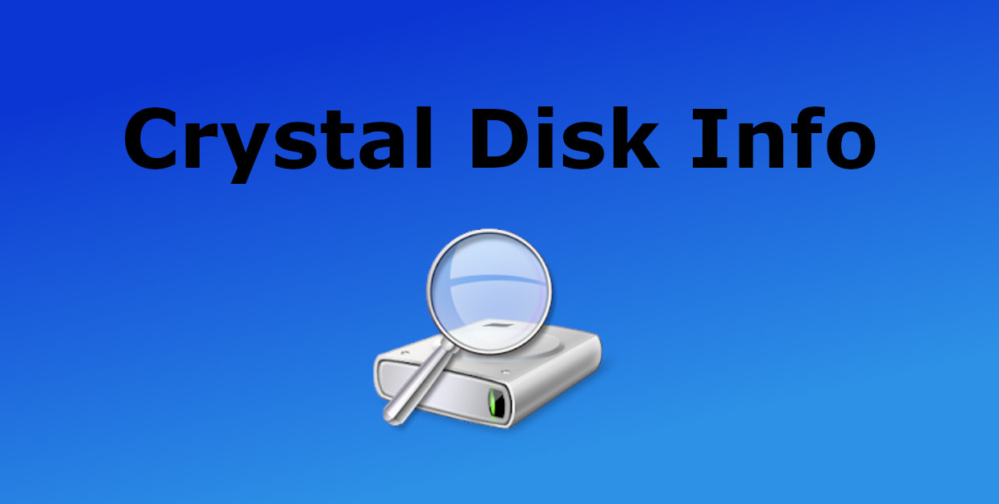
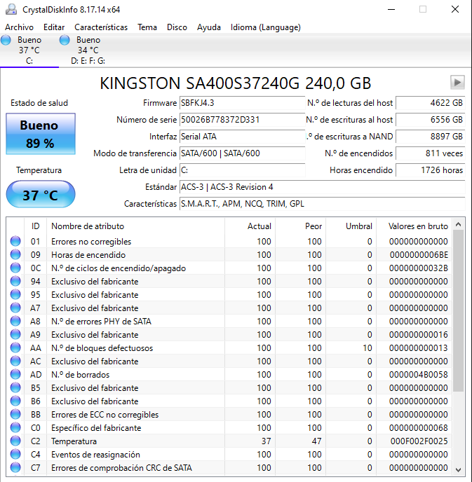

# CristalDisk Info

CrystalDisk Info es una herramienta que nos indica el estado de salud del disco, así como porcentaje de desgaste de la misma. También nos dice a la temperatura que trabaja la unidad, cantidad de datos leídos y escritos, y el número de veces y horas de encendido de la unidad.

- Este programa es muy facil de usar, simplemente lo ejecutamos y aparece la informacion descrita arriba. En el caso de tener mas de un disco, nos aparecerán en la parte superior, la cual los podremos seleccionar.  

- [Link Descarga](https://osdn.net/projects/crystaldiskinfo/downloads/78693/CrystalDiskInfo9_0_0RC2.exe/)
- [Video Explicativo](https://youtu.be/4eaKKwcwBck)
